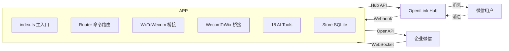

# @openilink/app-wecom

微信 <-> 企业微信双向消息桥接 + 18 个企业微信 AI Tools。

基于 [OpeniLink Hub](https://github.com/openilink) 平台，通过企业微信智能机器人 WebSocket 长连接实现低延迟消息互通，并为 AI Agent 提供丰富的企业微信操作能力。

## 功能特性

- **智能机器人长连接** - 基于 `@wecom/aibot-node-sdk` WebSocket 协议，无需公网回调即可接收消息
- **流式回复** - 支持 Markdown 流式回复，用户体验流畅
- **双向消息桥接** - 微信 -> 企业微信、企业微信 -> 微信自动转发
- **18 个 AI Tools** - 覆盖消息发送、通讯录、日程、审批、打卡、微盘、客户联系等核心场景
- **OAuth 自动安装** - 支持 PKCE 安全授权流程
- **SQLite 持久化** - 安装记录与消息关联可靠存储
- **Docker 部署** - 一键容器化部署，数据持久化

## 架构



## 快速开始

### 1. 创建企业微信智能机器人

1. 登录 [企业微信管理后台](https://work.weixin.qq.com/wework_admin/frame)
2. 进入 **应用管理** -> **创建应用** -> **智能机器人**
3. 获取 **BotID** 和 **Secret**

### 2. （可选）创建自建应用

如需使用通讯录、审批、打卡等 OpenAPI 功能：

1. 在管理后台创建 **自建应用**
2. 获取 **CorpID**（企业信息页面）和 **CorpSecret**（应用详情页面）
3. 在应用权限中开启所需的 API 权限

### 3. 配置环境变量

```bash
cp .env.example .env
# 编辑 .env 填入必要配置
```

### 4. 启动服务

```bash
# 开发模式
npm install
npm run dev

# 生产模式
npm run build
npm start

# Docker 部署
docker compose up -d
```

## 环境变量

| 变量名 | 必填 | 默认值 | 说明 |
|--------|------|--------|------|
| `HUB_URL` | 是 | - | OpeniLink Hub 地址 |
| `BASE_URL` | 是 | - | 本应用对外可访问的基础 URL |
| `WECOM_BOT_ID` | 是 | - | 企业微信智能机器人 BotID |
| `WECOM_BOT_SECRET` | 是 | - | 企业微信智能机器人 Secret |
| `WECOM_CORP_ID` | 否 | - | 企业 ID（OpenAPI 调用需要） |
| `WECOM_CORP_SECRET` | 否 | - | 应用 Secret（OpenAPI 调用需要） |
| `PORT` | 否 | `8085` | HTTP 监听端口 |
| `DB_PATH` | 否 | `data/wecom.db` | SQLite 数据库文件路径 |

## AI Tools (18个)

### 消息发送 (4)

| 工具名 | 说明 |
|--------|------|
| `send_wecom_message` | 发送企业微信应用文本消息 |
| `send_wecom_markdown` | 发送企业微信 Markdown 消息 |
| `send_wecom_card` | 发送企业微信模板卡片消息 |
| `send_wecom_news` | 发送企业微信图文消息 |

### 通讯录 (3)

| 工具名 | 说明 |
|--------|------|
| `get_user_info` | 获取企业微信成员详细信息 |
| `list_department_users` | 获取部门成员列表 |
| `list_departments` | 获取部门列表 |

### 日程 (3)

| 工具名 | 说明 |
|--------|------|
| `list_schedule` | 查看指定成员在时间范围内的日程 |
| `create_schedule` | 创建企业微信日程 |
| `get_free_busy` | 查询成员忙闲状态 |

### 审批 (2)

| 工具名 | 说明 |
|--------|------|
| `list_approvals` | 查询企业微信审批列表 |
| `get_approval_detail` | 查询企业微信审批单详情 |

### 打卡 (2)

| 工具名 | 说明 |
|--------|------|
| `get_checkin_data` | 查询企业微信打卡记录 |
| `get_checkin_rules` | 查询企业微信打卡规则 |

### 微盘 (2)

| 工具名 | 说明 |
|--------|------|
| `list_spaces` | 列出企业微信微盘空间列表 |
| `list_files` | 列出企业微信微盘空间中的文件 |

### 客户联系 (2)

| 工具名 | 说明 |
|--------|------|
| `list_external_contacts` | 列出成员的外部联系人列表 |
| `get_external_contact` | 查询外部联系人详情 |

## 企业微信配置指南

### 智能机器人配置

1. 在 [企业微信管理后台](https://work.weixin.qq.com/wework_admin/frame) 创建智能机器人
2. 记录 BotID 和 Secret，填入环境变量 `WECOM_BOT_ID` 和 `WECOM_BOT_SECRET`
3. 智能机器人使用 WebSocket 长连接，无需配置回调地址

### 自建应用配置（可选，用于 OpenAPI）

1. 在管理后台创建自建应用
2. 获取 CorpID（企业信息 -> 企业ID）和 CorpSecret（应用 -> 自建应用详情 -> Secret）
3. 在应用权限中开启以下 API 权限：
   - **通讯录管理** - 成员读取、部门读取
   - **OA** - 审批、打卡
   - **日程** - 日程读写
   - **微盘** - 空间和文件读取
   - **客户联系** - 外部联系人读取
4. 设置应用可见范围

### HTTP 路由

| 路径 | 方法 | 说明 |
|------|------|------|
| `/healthz` | GET | 健康检查 |
| `/manifest` | GET | 应用清单 |
| `/oauth/setup` | GET | OAuth 安装发起 |
| `/oauth/redirect` | GET | OAuth 回调 |
| `/webhook` | POST | Hub 事件接收 |

## License

MIT
