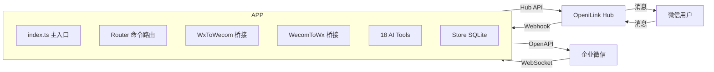

# @openilink/app-wecom

[](LICENSE)
[](https://www.typescriptlang.org/)
[](Dockerfile)

**微信 ↔ 企业微信双向消息桥接 + 18 个 AI Tools** — 消息、通讯录、日程、审批、打卡、微盘、客户联系全覆盖。

> 本项目是 [OpeniLink Hub](https://github.com/openilink/openilink-hub) 的官方 App。Hub 是开源的微信 Bot 管理平台 + App 应用市场。

## 功能亮点

- **智能机器人长连接** — 基于 `@wecom/aibot-node-sdk` WebSocket 协议，无需公网回调即可接收消息
- **流式回复** — 支持 Markdown 流式回复，用户体验流畅
- **双向消息桥接** — 微信 → 企业微信、企业微信 → 微信自动转发
- **18 个 AI Tools** — 覆盖消息发送、通讯录、日程、审批、打卡、微盘、客户联系等核心场景
- **OAuth 自动安装** — 支持 PKCE 安全授权流程
- **SQLite 持久化** — 安装记录与消息关联可靠存储
- **Docker 一键部署** — 一键容器化部署，数据持久化

## 使用方式

安装到 Bot 后，支持三种方式调用：

### 自然语言（推荐）

直接用微信跟 Bot 对话，Hub AI 会自动识别意图并调用对应功能：

- "用企业微信通知全组明天开会"
- "查一下打卡记录"

### 命令调用

使用 `/命令名 参数` 的格式直接调用：

- `/send_wecom_message --to_user xxx --text 你好`

### AI 自动调用

Hub AI 在多轮对话中会自动判断是否需要调用本 App 的功能，无需手动触发。

## AI Tools（18 个）

### 消息发送 — 4 个

| 工具名 | 说明 |
|--------|------|
| `send_wecom_message` | 发送企业微信应用文本消息 |
| `send_wecom_markdown` | 发送企业微信 Markdown 消息 |
| `send_wecom_card` | 发送企业微信模板卡片消息 |
| `send_wecom_news` | 发送企业微信图文消息 |

### 通讯录 — 3 个

| 工具名 | 说明 |
|--------|------|
| `get_user_info` | 获取企业微信成员详细信息 |
| `list_department_users` | 获取部门成员列表 |
| `list_departments` | 获取部门列表 |

### 日程 — 3 个

| 工具名 | 说明 |
|--------|------|
| `list_schedule` | 查看指定成员在时间范围内的日程 |
| `create_schedule` | 创建企业微信日程 |
| `get_free_busy` | 查询成员忙闲状态 |

### 审批 — 2 个

| 工具名 | 说明 |
|--------|------|
| `list_approvals` | 查询企业微信审批列表 |
| `get_approval_detail` | 查询企业微信审批单详情 |

### 打卡 — 2 个

| 工具名 | 说明 |
|--------|------|
| `get_checkin_data` | 查询企业微信打卡记录 |
| `get_checkin_rules` | 查询企业微信打卡规则 |

### 微盘 — 2 个

| 工具名 | 说明 |
|--------|------|
| `list_spaces` | 列出企业微信微盘空间列表 |
| `list_files` | 列出企业微信微盘空间中的文件 |

### 客户联系 — 2 个

| 工具名 | 说明 |
|--------|------|
| `list_external_contacts` | 列出成员的外部联系人列表 |
| `get_external_contact` | 查询外部联系人详情 |

## 快速开始 — 应用市场一键安装

1. 打开 [OpeniLink Hub](https://github.com/openilink/openilink-hub) 管理后台
2. 进入 **应用市场**，找到 **企业微信桥接**
3. 点击 **安装**，按提示填入企业微信 BotID / Secret
4. 安装完成后即可在微信中使用

<details>
<summary><strong>自部署 — Docker</strong></summary>

```bash
# 使用 docker-compose
docker compose up -d
```

或源码运行：

```bash
git clone https://github.com/openilink/openilink-app-wecom.git
cd openilink-app-wecom
npm install
cp .env.example .env   # 编辑 .env 填入实际值
npm run dev             # 开发模式
npm run build && npm start  # 生产模式
```

</details>

<details>
<summary><strong>环境变量</strong></summary>

| 变量名 | 必填 | 默认值 | 说明 |
|--------|------|--------|------|
| `HUB_URL` | 是 | — | OpeniLink Hub 地址 |
| `BASE_URL` | 是 | — | 本应用对外可访问的基础 URL |
| `WECOM_BOT_ID` | 是 | — | 企业微信智能机器人 BotID |
| `WECOM_BOT_SECRET` | 是 | — | 企业微信智能机器人 Secret |
| `WECOM_CORP_ID` | 否 | — | 企业 ID（OpenAPI 调用需要） |
| `WECOM_CORP_SECRET` | 否 | — | 应用 Secret（OpenAPI 调用需要） |
| `PORT` | 否 | `8085` | HTTP 监听端口 |
| `DB_PATH` | 否 | `data/wecom.db` | SQLite 数据库文件路径 |

</details>

<details>
<summary><strong>企业微信配置指南</strong></summary>

### 创建企业微信智能机器人

1. 登录 [企业微信管理后台](https://work.weixin.qq.com/wework_admin/frame)
2. 进入 **应用管理** → **创建应用** → **智能机器人**
3. 获取 **BotID** 和 **Secret**
4. 智能机器人使用 WebSocket 长连接，无需配置回调地址

### （可选）创建自建应用

如需使用通讯录、审批、打卡等 OpenAPI 功能：

1. 在管理后台创建 **自建应用**
2. 获取 **CorpID**（企业信息页面）和 **CorpSecret**（应用详情页面）
3. 在应用权限中开启以下 API 权限：
   - **通讯录管理** — 成员读取、部门读取
   - **OA** — 审批、打卡
   - **日程** — 日程读写
   - **微盘** — 空间和文件读取
   - **客户联系** — 外部联系人读取
4. 设置应用可见范围

### HTTP 路由

| 路径 | 方法 | 说明 |
|------|------|------|
| `/healthz` | GET | 健康检查 |
| `/manifest` | GET | 应用清单 |
| `/oauth/setup` | GET | OAuth 安装发起 |
| `/oauth/redirect` | GET | OAuth 回调 |
| `/webhook` | POST | Hub 事件接收 |

</details>

<details>
<summary><strong>开发指南</strong></summary>

### 架构



</details>

## 安全与隐私

- **消息内容不落盘** — 消息内容仅在内存中中转，不会存储到数据库或磁盘
- **仅保存消息 ID 映射** — 数据库中只保存消息 ID 对应关系（用于回复路由），不保存消息正文
- **用户数据严格隔离** — 所有查询均按 `installation_id` + `user_id` 双重过滤，不同用户之间完全隔离
- **应用市场安装（托管模式）** — 不会记录、存储或分析用户的消息内容；所有代码完全开源，接受社区审查
- **自部署** — 如需更高隐私保障，可自行部署，所有数据仅在您自己的服务器上流转

## License

MIT
